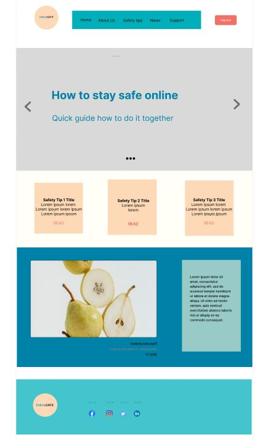
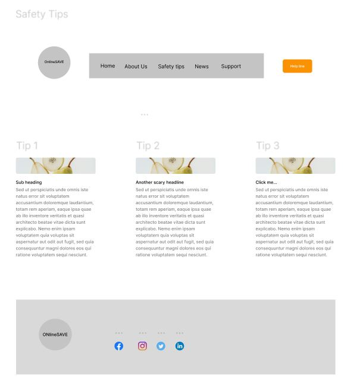
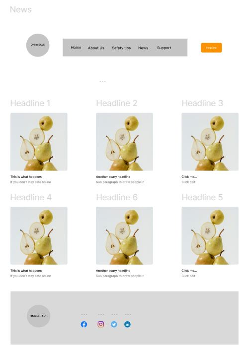

<a name="readme-top"></a>

<!-- PROJECT LOGO -->
<br />
<div align="center">
  <a href="https://github.com/Swetlanda/stay-safe-online">
    
  </a>

<h3 align="center">Stay Safe Online (Code Institute Hackathon 1) - Lola's Cupcakes</h3>

  <p align="center">
    Hackathon 1: Full Stack Web Development. Work is small groups, using HTML and CSS to practice and develop front end web design. Design and create a site entitles "Staying Safe Online"
    <br />
    <a href="https://github.com/swetlanda/stay-safe-online"><strong>Explore the docs »</strong></a>
    <br />
  </p>
</div>


<!-- TABLE OF CONTENTS -->
<details>
  <summary>Table of Contents</summary>
  <ol>
    <li>
      <a href="#about-the-project">About The Project</a>
      <ul>
        <li><a href="#built-with">Built With</a></li>
      </ul>
    </li>
    <li>
      <a href="#getting-started">Getting Started</a>
      <ul>
        <li><a href="#prerequisites">Prerequisites</a></li>
        <li><a href="#installation">Installation</a></li>
      </ul>
    </li>
    <li><a href="#usage">Usage</a></li>
    <li><a href="#roadmap">Roadmap</a></li>
    <li><a href="#contributing">Contributing</a></li>
    <li><a href="#license">License</a></li>
    <li><a href="#contact">Contact</a></li>
    <li><a href="#acknowledgments">Acknowledgments</a></li>
  </ol>
</details>


<!-- ABOUT THE PROJECT -->
## About The Project

[![Product Name Screen Shot][product-screenshot]](https://github.com/Swetlanda/stay-safe-online)

Project Goals "Stay Safe Online" is an initiative launched during the Code Institute Hackathon 1, aimed at providing a hands-on learning experience in front-end web development while addressing the critical issue of online safety.

Our objective, working in teams of three, is to develop a website that educates users on best practices for maintaining online safety, covering topics such as cyberbullying, identity theft, and phishing scams.

## Ideation

## User Goals
* Access concise information on online safety.
* Easily navigate to find internet safety tips.
* Stay updated on recent cybersecurity news.
* Have a user-friendly helpline form for assistance.

## Site Owner Goals
* Offer essential information on online safety with additional reading resources.
* Provide up-to-date relevant news on cybersecurity.
* Enable users to contact us conveniently via a message form.

## Features
## Landing Page
* Engaging carousel with a welcome message "How To Stay Safe Online: Quick Guide on Staying Secure Together."
* Selection of visually captivating images with a clear message.
* Integration of Bootstrap card functionality for responsiveness and easy access to safety tips.
* Inclusion of a video on online security to cater to users preferring visual content.
* Display of three recent news articles to pique interest and relevance.
## Safety Tips Page:
* Clearly defined title and summary content.
* Presentation of key safety tips with the option to explore further.
* Responsive design to ensure optimal viewing across devices, with tips arranged in rows and collapsible for mobile devices.
## News Page:
* Clearly defined title and summary content.
* Display of recent news articles with images for visual appeal.
* Responsive layout for optimal viewing experience on various devices, ensuring readability and accessibility.
## Helpline Form:
* Inclusion of a user-friendly form for users to contact us if needed.
* Quick access to the helpline through a dedicated button on the navigation bar for added convenience.


-----------
<br>

Much of the initial design was undertaken using bootstrap, before overlaying bespoke design preferences. 

An agile methodology and principal was employed across 3 days to design and develop the site.

<p align="right">(<a href="#readme-top">back to top</a>)</p>


### Built With


* [![Bootstrap][Bootstrap.com]][Bootstrap-url]


<p align="right">(<a href="#readme-top">back to top</a>)</p>


<!-- GETTING STARTED -->
## Getting Started

To get a local copy up and running follow the simple instruction below. There are no prerequisites and no local installation is required. You can then use, adapt and improve our page! Please remember to give credit to the creators (Github: PeterECoder, Swetlanda, Sasha-create).


Clone the repo
   ```sh
   git clone https://github.com/swetlanda/stay-safe-online.git
   ```

<p align="right">(<a href="#readme-top">back to top</a>)</p>


<!-- USAGE EXAMPLES -->
## UX/UI

## Target Audience
People who want to know more about how to stay safe online and specifically young adults who may not have much experience 
People who want to read recent news about cybersecurity
People who want to watch video with online safety tips
People who need help and want to get in touch 
This impact our design and the intended UK in a number of ways.

<p align="right">(<a href="#readme-top">back to top</a>)</p>


<!-- DESIGN -->
## User Stories
* As a user, I want to read clear and simple tips on how to stay safe online.
* As a user, I want to see a navbar with clear links to all pages on the site, so I can easily access them.
* As a user, I want to see a footer with important social media links so I can follow them on social media.
* As a user, I want to see an engaging hero images that quickly conveys the website's purpose, so I can decide whether to continue using the site.
* As a user, I want to see an appropriate welcome message that clearly explains the website's purpose, so that I can decide whether to continue using the site.
* As a user, I want to watch engaging videos with tutorials or demonstrations on setting up privacy settings.
* As a user, I want a quick way to contact someone for help, such as sending a form.
* As a user, I want to read recent news about cybercrimes and tips on how to stay safe online.
* As a user I want to see some tips on cybersecurity so I can read more.
* As a developer I want to create Readme file so that people understand easily the website, its purpose and structure


### Visuals
Simple, consistent page layouts were used across all three pages.

#### Landing Page


#### Safety Tips Page


#### News Page


### Colour Palette
We selected a bright set of contrasting, attention-grabbing colours which are visually appealing to a younger audience.

### Fonts
Simple, non-cursive fonts were used to ensure good readability for the younger audience.

### Navigation
A simple and familar (but adaptive) navigation framework was used in order to ensure that children could move between the key elements of the site.

<p align="right">(<a href="#readme-top">back to top</a>)</p>

<!-- TESTING -->
## Testing
Vigorous testing was undertaken to ensure all features and links work. 

Generic links were used for social medie sites and emails, but these were taken as a "pass".

### Validation
The website and all it's individual pages were validated through HTML and CSS validator.

### Accessibility
This website contains alt text for images and links where appropriate for all users to view and browse the website and also in case any images fail to load, the alt text will display what would have been there so the website is still somewhat usable.


<p align="right">(<a href="#readme-top">back to top</a>)</p>

<!-- ROADMAP -->
## Roadmap

- [ ] Landing page
    - [ ] Navigation bar
    - [ ] Hero image
    - [ ] Carousel images
    - [ ] Safety tip featured items
    - [ ] Video
    - [ ] New feauted items 
    - [ ] Footer
- [ ] Adaptive design for different screen sizes
- [ ] Tips for staying safe online (page)
- [ ] News page
- [ ] Helpline page with Form for getting in touch
- [ ] Social media links
- [ ] Contact information
- [ ] Helpline Button with Form for getting in touch


See the [open issues](https://github.com/swetlanda/stay-safe-online/issues) for a full list of proposed features (and known issues).

<p align="right">(<a href="#readme-top">back to top</a>)</p>


<!-- CONTRIBUTING -->
## Contributing

Contributions are what make the open source community such an amazing place to learn, inspire, and create. Any contributions you make are **greatly appreciated**.

If you have a suggestion that would make this better, please fork the repo and create a pull request. You can also simply open an issue with the tag "enhancement".
Don't forget to give the project a star! Thanks again!

1. Fork the Project
2. Create your Feature Branch (`git checkout -b feature/AmazingFeature`)
3. Commit your Changes (`git commit -m 'Add some AmazingFeature'`)
4. Push to the Branch (`git push origin feature/AmazingFeature`)
5. Open a Pull Request

<p align="right">(<a href="#readme-top">back to top</a>)</p>


<!-- LICENSE -->
## License

No licenses required or used in this project.

<p align="right">(<a href="#readme-top">back to top</a>)</p>

<!-- Deployment  -->
Deployment
Site was deployed as follows:

Site was deployed on GitHub

<!-- CONTACT -->
## Contact

Peter Ellis - peterjaellis@gmail.com
Lola - swetlanda@gmail.com
Aleksandra - aleksandraknott@gmail.com

Project Link: [https://github.com/swetlanda/stay-safe-online](https://github.com/swetlanda/stay-safe-online)

<p align="right">(<a href="#readme-top">back to top</a>)</p>


<!-- ACKNOWLEDGMENTS -->
## Acknowledgments

* []()jpawlowski for the template readme file
* []() coloors.co for a colour template
* []() figma.com for site wireframing
* []() Chat GPT AI for creation of content 

<p align="right">(<a href="#readme-top">back to top</a>)</p>


<!-- MARKDOWN LINKS & IMAGES -->
<!-- https://www.markdownguide.org/basic-syntax/#reference-style-links -->
[contributors-shield]: https://img.shields.io/github/contributors/swetlanda/stay-safe-online.svg?style=for-the-badge
[contributors-url]: https://github.com/swetlanda/stay-safe-online/graphs/contributors
[forks-shield]: https://img.shields.io/github/forks/swetlanda/stay-safe-online.svg?style=for-the-badge
[forks-url]: https://github.com/swetlanda/stay-safe-online/network/members
[stars-shield]: https://img.shields.io/github/stars/swetlanda/stay-safe-online.svg?style=for-the-badge
[stars-url]: https://github.com/swetlanda/stay-safe-online/stargazers
[issues-shield]: https://img.shields.io/github/issues/swetlanda/stay-safe-online.svg?style=for-the-badge
[issues-url]: https://github.com/swetlanda/stay-safe-online/issues
[license-shield]: https://img.shields.io/github/license/swetlanda/stay-safe-online.svg?style=for-the-badge
[license-url]: https://github.com/swetlanda/stay-safe-online/blob/master/LICENSE.txt
[linkedin-shield]: https://img.shields.io/badge/-LinkedIn-black.svg?style=for-the-badge&logo=linkedin&colorB=555
[linkedin-url]: https://linkedin.com/in/peterjaellis
[product-screenshot]: /assets/images/project-name.JPG
[Bootstrap.com]: https://img.shields.io/badge/Bootstrap-563D7C?style=for-the-badge&logo=bootstrap&logoColor=white
[Bootstrap-url]: https://getbootstrap.com